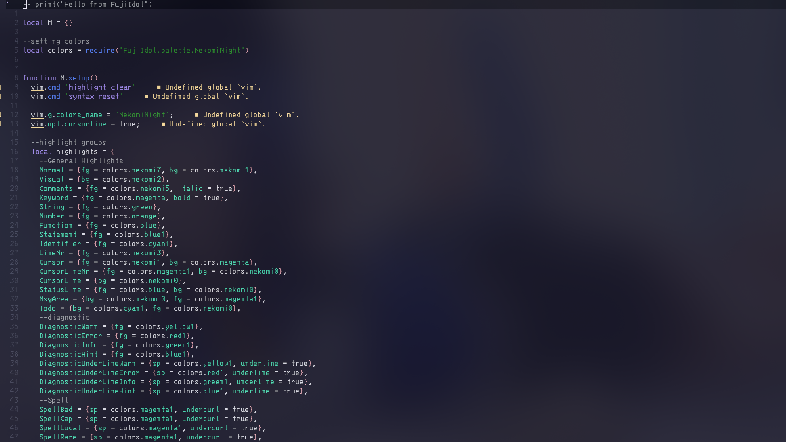
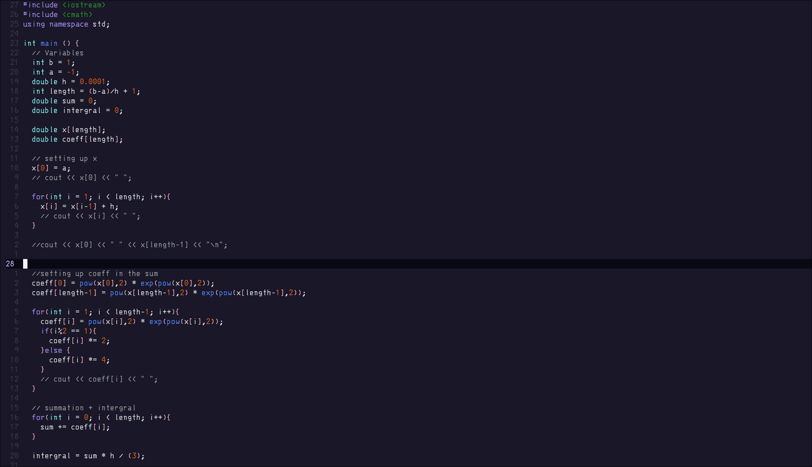

# FujiIdol.nvim

neovim port for the FujiIdol color scheme

## Previews




## Installation

**Lazy.nvim:**
```lua
{
  "Nekomi-ch/FujiIdol.nvim",
  priority = 1000,
  config = function()
    vim.cmd([[colorscheme NekomiNight]])
  end,
}
```

## Plugins

- [Cmp](https://github.com/hrsh7th/nvim-cmp)
- [LuaLine](https://github.com/nvim-lualine/lualine.nvim) 

More to come

## Palette 

[See here](https://github.com/Nekomi-ch/FujiIdol/tree/main?tab=readme-ov-file#palette)

## Disclaimer

I don't think it is fully done, but I think you can use it for now. 
There probably is a lot left to do, but I have no idea what is left so by using it you can help me gain info on what is missing.
Thank you.

## Todo
- [ ] Treesitter 
- [ ] Telescope
- [ ] Which-key
